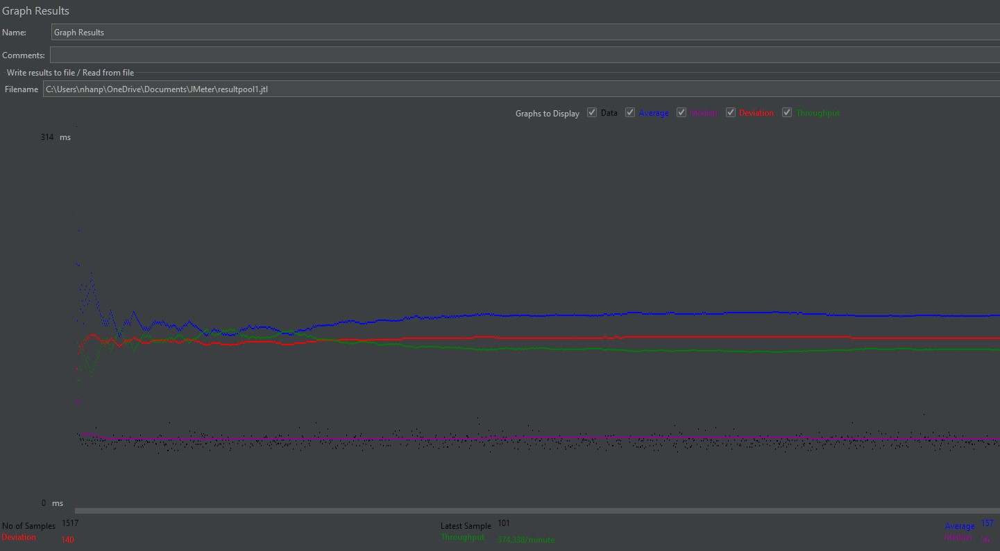
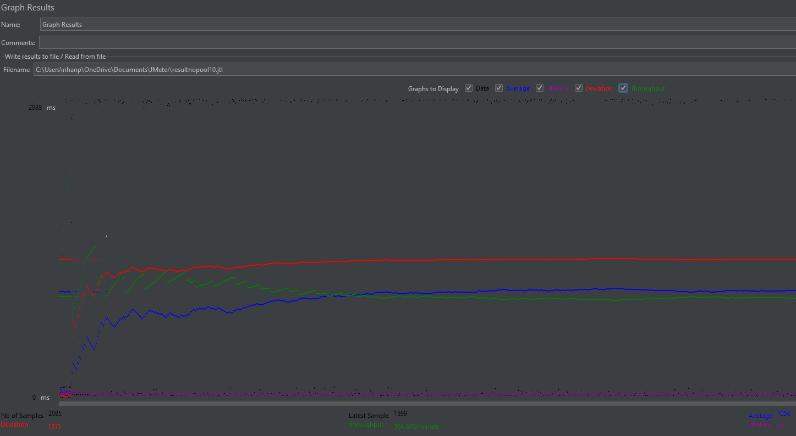
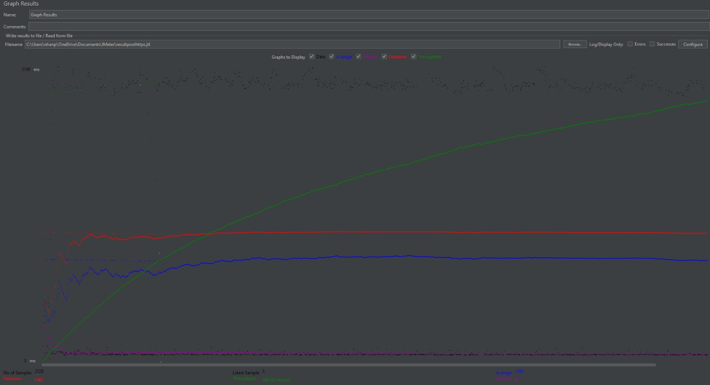
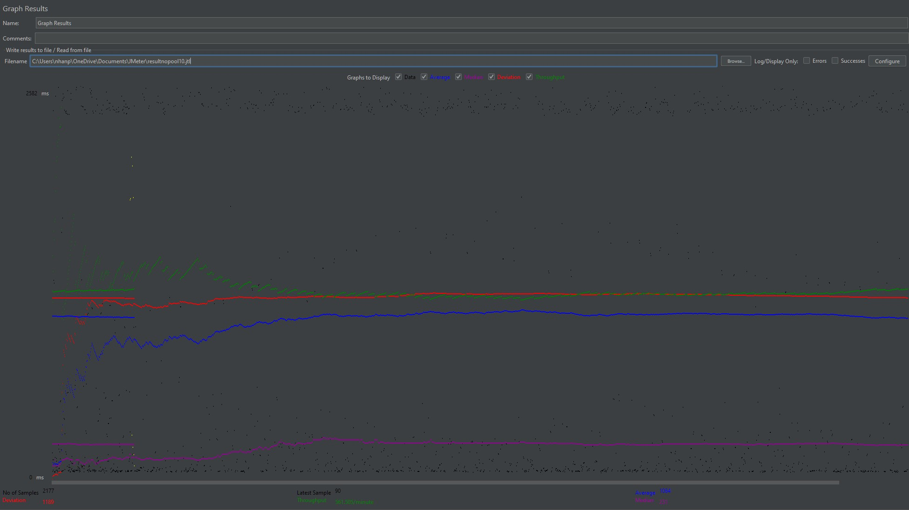
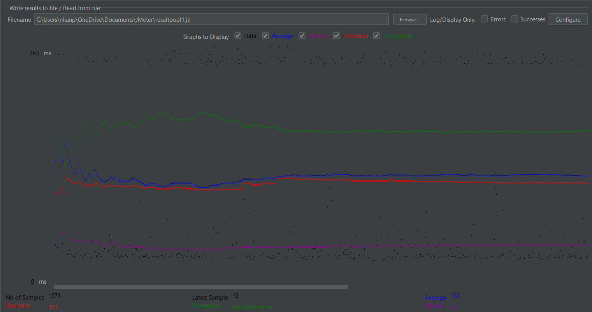
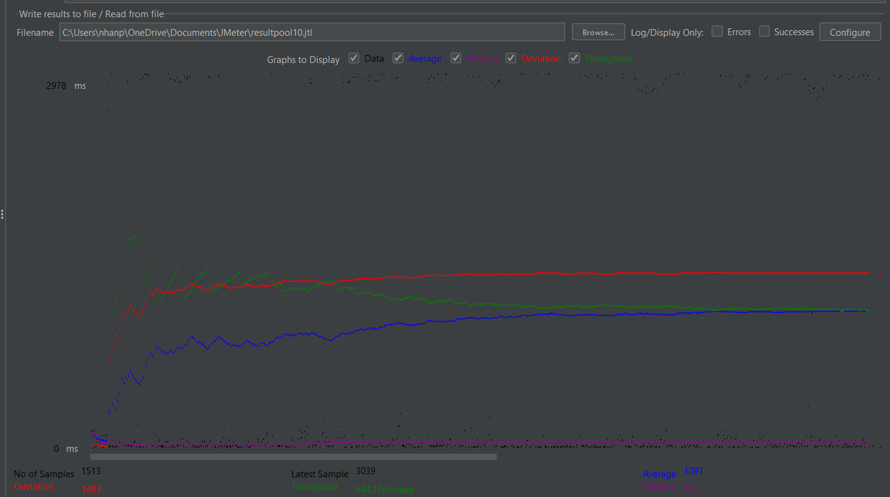
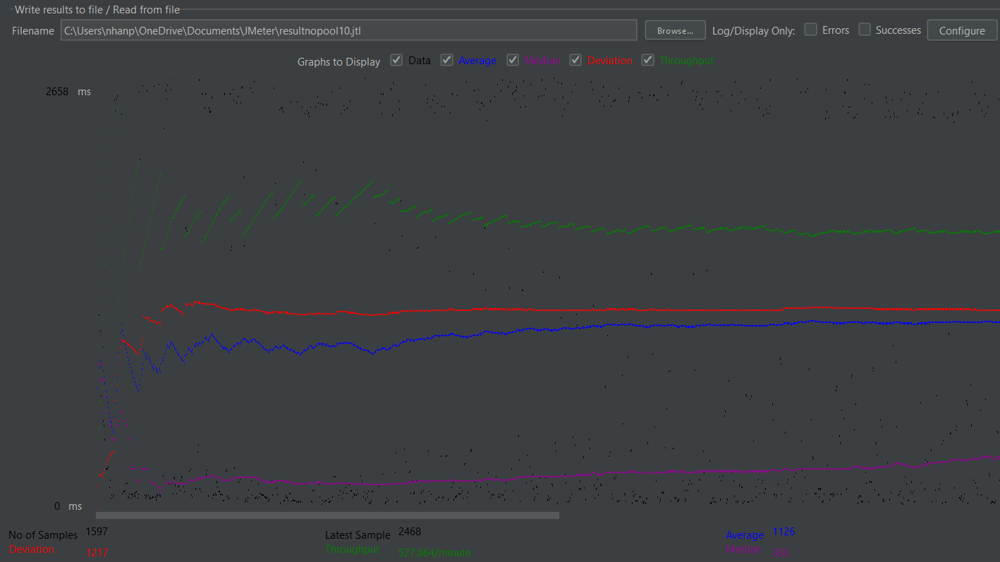

<h1>Demo Video</h1>

<a href="https://youtu.be/R0W7nprJBlc">Project 1</a>

<a href="https://youtu.be/OKu-IR647D0">Project 2</a>

<a href="https://youtu.be/vudEJu_3s5Y">Project 3</a>

<a href="https://youtu.be/XGotUFmHk7o">Project 4</a>

<a href="https://youtu.be/4ZZ6Na-rSuQ">Project 5</a>

<h1>Project 1 Contribution</h1>

Anh Vo: set up SQL database, create movie list page, and style CSS

Raymond Chou: set up AWS, create single movie page + single star page, and record video

<h1>Project 2 Contribution</h1>

Substring matching design: use LIKE = "%str%" and LIKE = "s%" in sql query

Anh Vo: task 2 and 4, implement css

Raymond Chou: task 1 and 3, set up AWS, record video

<h1>Project 3 Contribution</h1>

Anh Vo: task 5, task 6-create XML parser for main243.xml

Raymond Chou: Task 1-4, task 6-create XML parser for casts124.xml + actors63.xml

<h3>Filenames with Prepared Statements</h3>
EasyCommunicate.java, SingleMovieServlet.java, XMLMovieParser.java

<h3>Stored Procedure File</h3>
stored_procedure.sql

<h3>Inconsistent Reports</h3>
All located in the log directory

<h3>Optimization for XML parser</h3>
Naive Approach:

- parse xml file using DOM parser, when encouter a new entry, create a new prepareStatement and call a stored procedure to handle check for duplicates
- More than 20 min to run locally without deploying to AWS

Batch Insert:
- use executeBatch() 
- time reduce down to about 15 min when run locally

Cache Table: 
 - for each xml file, cache certain table data to check for duplicate locally
 - time reduce down to 10 seconds when run locally and 28 seconds on AWS

<h1>Project 4 Contribution</h1>

Anh Vo: task 2

Raymond Chou: Task 1 and record video

<h1>Project 5 Contribution and Report</h1>

- # General
    - #### Team#: fullstack_devs
    
    - #### Names: Anh Vo, Raymond Chou
    
    - #### Project 5 Video Demo Link:

    - #### Instruction of deployment: 
      - Clone this GitHub repository
      - Change directories into locally cloned repository
      - Run "mvn package"
      - Run "sudo cp ./target/*.war /var/lib/tomcat10/webapps/"
      - Go to manager website and open your deployed webapp

    - #### Collaborations and Work Distribution:
      - Task 1: Anh Vo
      - Task 2+3: Raymond Chou
      - Task 4: Anh Vo + Raymond Chou
      - Video Recording: Raymond Chou

- # Connection Pooling
    - #### Config file for connection pooling: context.xml
    
    - #### Explain how Connection Pooling is utilized in the Fabflix code.
       -  Connection Pooling is used for EasyCommunication, which is the main class that is used to connect to the JDBC. Every time a Servlet is initialized, a new instance of EasyCommunication would also be initialized along with the connections pools that the servlet can use. Doing so would allow the Servlet to reuse connections and increase performance.
    
    - #### Explain how Connection Pooling works with two backend SQL.
       - Connection Pooling maintains a "pool" of connections that can be reused throughout a multitutde of databases. By distributing these connections throughout the two backend SQL, these databases can share the load with one another and enhance the performance through load balancing.

- # Master/Slave
    - #### Include the filename/path of all code/configuration files in GitHub of routing queries to Master/Slave SQL.
      - Datasources for the Master SQL backend and the Slave SQL backend was planned to be created in the context.xml file and named in the web.xml file, but connection issues arised and we didn't have enough time to fix it.

    - #### How read/write requests were routed to Master/Slave SQL?
      - A MySQL Router was set up to redirect read-write requests to the Master SQL backend and read-only requests to the Slave SQL backend.
    

- # JMeter TS/TJ Time Logs
    - Time logs are processed using log_processor java class that is located in the src folder. The program takes two args, the first one is a String representing the file path for tj log and the second is another String file path for ts log. 

- # JMeter TS/TJ Time Measurement Report

| **Single-instance Version Test Plan**          | **Graph Results Screenshot** | **Average Query Time(ms)** | **Average Search Servlet Time(ms)** | **Average JDBC Time(ms)** | **Analysis**                                                                                                                                                                                                                                                                                                                                                                                                                                              |
|------------------------------------------------|------------------------------|----------------------------|-------------------------------------|---------------------------|-----------------------------------------------------------------------------------------------------------------------------------------------------------------------------------------------------------------------------------------------------------------------------------------------------------------------------------------------------------------------------------------------------------------------------------------------------------|
| Case 1: HTTP/1 thread                          |    | 157                        | 107.35                              | 105.89                    | In this case, the server manage to run the query fairly quickly, as shown by all the measurement. This is to be expected since only one thread is use for the test plan.                                                                                                                                                                                                                                                                                  |
| Case 2: HTTP/10 threads                        |    | 1058                       | 1015.83                             | 1014.04                   | The measurement significantly increases in this test plan as compared to the previous 1-thread test plan. It is likely that due to the high throughput, the server database is overwhelmed, causing the average query time to be extremely high due to outliers despite the median query time being extremely low.                                                                                                                                        |
| Case 3: HTTPS/10 threads                       |    | 1080                       | 1001.73                             | 999.13                    | In this case, the average query time is higher than all the other tests. Seeing as the differences between average query time and average servlet time is more noticeable, this time increase is likely due to the https higher latency. Additionally, the throughput for this case is at the lowest in single instance with multiple threads.                                                                                                            |
| Case 4: HTTP/10 threads/No connection pooling  |    | 1064                       | 1020.44                             | 838.34                    | The median for this test case is fairly high at about 230 ms per query. Additionally, there is a 200 ms jump between the servlet time and the time required to execute the query, indicating that the overhead for establishing a connection without pooling is fairly costly. |

| **Scaled Version Test Plan**                   | **Graph Results Screenshot** | **Average Query Time(ms)** | **Average Search Servlet Time(ms)** | **Average JDBC Time(ms)** | **Analysis** |
|------------------------------------------------|------------------------------|----------------------------|-------------------------------------|---------------------------|--------------|
| Case 1: HTTP/1 thread                          |    | 162                         | 109.95                              | 108.25                    | The queries ran relatively quickly, which is expected considering the 1 thread configuration. However, it ran a bit slower compared to its non-scaled counterpart which is surprising and could be accounted for by some misconfigurations with the load balancing.         |
| Case 2: HTTP/10 threads                        |    | 1091                         | 1061.83                             | 1058.44                   | As was with the single instance, testing the scaled webapp on 10 threads ran significantly slower in average query time, search servlet time, and JDBC time compared to running on only 1 thread. This is expected considering the increase in throughput and overall load sent to the server end. Surprisingly yet again, however, this scaled instance ran slightly slower than the non-scaled instance. Misconfigurations with load balancing and/or invalid master/slave replication may have accounted for this error.           |
| Case 3: HTTP/10 threads/No connection pooling  |    | 1126                         | 1063.85                              | 870.51                  |   Despite having scaled configuration for its deployment, the server performed extremely slow with a median response time of 333ms and an average response time of 1126ms. The server received extensive load from the 10-thread test plan and in turn responded slowly because it did not have connection pooling configured, which significantly reduces the cost of opening and closing a connection when executing SQL operations.         |
